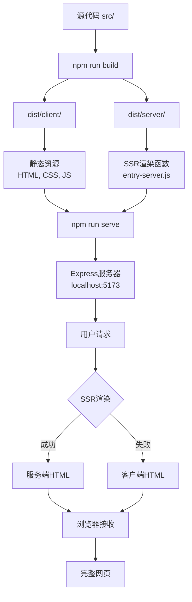

# 🔄 Build vs Serve 可视化流程图

## 📊 **整体架构图**



## ⏱️ **时间线对比**

### npm run build (一次性执行)
```
时间轴: 0s ────────────► 4.045s
       │                    │
       开始               构建完成
       │                    │
       └─ 编译中 ──────────┘
         ├─ TypeScript → JavaScript
         ├─ React → 渲染函数  
         ├─ CSS → 压缩样式
         └─ 资源 → 优化打包
```

### npm run serve (持续运行)
```
时间轴: 0s ────► 启动 ────► ∞ (持续运行)
       │         │          │
       开始     服务器      处理请求
       │      就绪 1s       │
       └────────┴─────────► 每个请求 ~300ms
                           ├─ 路由解析
                           ├─ SSR尝试  
                           ├─ HTML生成
                           └─ 网络传输
```

---

## 🏗️ **构建过程详细流程**

```
源文件                     构建工具                输出文件
┌─────────────┐           ┌─────────────┐          ┌─────────────┐
│ src/App.tsx │  ────────► │ Vite Build  │ ──────►  │ App-xxx.js  │
│ src/*.tsx   │           │ (TypeScript)│          │ (998KB)     │
│ src/*.css   │           │ (Rollup)    │          │             │
└─────────────┘           │ (esbuild)   │          │ index.css   │
                          └─────────────┘          │ (59KB)      │
                                                   └─────────────┘
                                 │
                                 ▼
┌─────────────┐           ┌─────────────┐          ┌─────────────┐
│src/entry-   │  ────────► │ Vite SSR    │ ──────►  │entry-server │
│server.tsx   │           │ Build       │          │.js (372KB)  │
└─────────────┘           └─────────────┘          └─────────────┘
```

---

## 🚀 **服务器运行流程**

```
服务器启动                    请求处理                   响应生成
┌─────────────┐             ┌─────────────┐            ┌─────────────┐
│ server.js   │             │ 接收请求    │            │ HTML模板    │
│ 读取配置    │ ──────────► │ GET /       │ ─────────► │ 加载完成    │
│ 启动Express │             │ POST /api   │            │             │
└─────────────┘             └─────────────┘            └─────────────┘
       │                            │                         │
       ▼                            ▼                         ▼
┌─────────────┐             ┌─────────────┐            ┌─────────────┐
│ 导入SSR模块 │             │ 尝试SSR渲染 │            │ 注入内容    │
│ entry-server│ ──────────► │ render(url) │ ─────────► │ <div id=    │
│ .js         │             │             │            │ "root">HTML │
└─────────────┘             └─────────────┘            └─────────────┘
       │                            │                         │
       ▼                            ▼                         ▼
┌─────────────┐             ┌─────────────┐            ┌─────────────┐
│ 静态资源    │             │ 错误处理    │            │ 发送响应    │
│ dist/client │             │ 回退CSR     │            │ 200 OK      │
│ assets/     │             │             │            │ text/html   │
└─────────────┘             └─────────────┘            └─────────────┘
```

---

## 📁 **文件依赖关系图**

```
项目根目录
├── src/                    (开发源码)
│   ├── App.tsx            ──┐
│   ├── entry-client.tsx   ──┼─► npm run build
│   ├── entry-server.tsx   ──┘
│   └── components/
│
├── dist/                   (构建产物)
│   ├── client/            ◄─── build:client
│   │   ├── index.html     ──┐
│   │   └── assets/        ──┼─► npm run serve
│   └── server/            ◄─┘  (读取这些文件)
│       └── entry-server.js
│
├── server.js              ◄─── 生产服务器入口
├── package.json           
└── vite.config.ts         ◄─── 构建配置
```

---

## 🔄 **数据流转图**

### 构建阶段数据流
```
TypeScript代码 → 编译器 → JavaScript代码
     │              │            │
React组件    → Babel  → ES5函数
     │              │            │  
CSS样式     → PostCSS → 压缩CSS
     │              │            │
图片资源    → 优化器  → WebP/压缩
     │              │            │
     └─────────────►│◄───────────┘
                    ▼
              打包合并 (Bundle)
                    │
                    ▼
            生成 dist/ 文件夹
```

### 运行阶段数据流
```
HTTP请求 → Express路由 → server.js处理
    │           │              │
用户访问 → 路径解析 → 查找对应页面
    │           │              │
浏览器   → 参数解析 → 准备渲染数据
    │           │              │
    └──────────►│◄─────────────┘
                ▼
        SSR渲染引擎 (React)
                │
                ▼
    ┌─ 成功 → 完整HTML ─┐
    │                  │
    └─ 失败 → 空HTML ──┘
                │
                ▼
        返回HTTP响应
                │
                ▼
        浏览器接收并显示
```

---

## 📊 **性能指标对比**

### 构建性能 (npm run build)
```
指标              数值        含义
─────────────────────────────────────
总时间           4.045s      完整构建周期
客户端构建       3.000s      主要时间消耗
服务端构建       0.409s      快速SSR编译
模块转换         2,464个     处理的文件数
输出大小         1.9MB       最终产物大小
CPU使用率        100%        编译期间满载
内存峰值         ~300MB      Node.js + 编译器
```

### 服务器性能 (npm run serve)
```
指标              数值        含义
─────────────────────────────────────
启动时间         <1s         Express启动
首次响应         344ms       包含SSR尝试
静态资源         <50ms       直接文件服务
并发请求         >100/s      Express处理能力
内存使用         ~50MB       运行时占用
CPU使用率        <10%        空闲时消耗
```

---

## 🎯 **关键差异总结表**

| 维度 | npm run build | npm run serve |
|------|---------------|---------------|
| **执行性质** | 一次性任务 | 持续运行服务 |
| **主要目的** | 编译和优化代码 | 提供HTTP服务 |
| **输入内容** | 源代码 (src/) | 构建产物 (dist/) |
| **输出结果** | 静态文件 | HTTP响应 |
| **时间特性** | 4秒完成 | 24/7运行 |
| **资源占用** | 高CPU短时间 | 低CPU长时间 |
| **网络端口** | 无 | 5173端口监听 |
| **用户交互** | 开发者操作 | 终端用户访问 |
| **错误影响** | 构建失败 | 服务不可用 |
| **依赖关系** | 独立执行 | 依赖build产物 |

---

## 🏆 **最佳实践工作流**

### 开发阶段
```bash
npm run dev:spa    # 开发服务器 (热更新, 快速迭代)
    ↓
代码修改 → 自动刷新 → 立即预览
```

### 测试阶段  
```bash
npm run build      # 构建生产版本
npm run serve      # 本地测试生产环境
    ↓
发现问题 → 修改代码 → 重新构建 → 再次测试
```

### 部署阶段
```bash
npm run build      # CI/CD环境构建
    ↓
dist/ 文件夹 → 部署到服务器 → npm run serve
```

### 监控运维
```bash
npm run serve      # 生产服务器
    ↓  
日志监控 → 性能分析 → 错误报告 → 版本更新
```

这样的流程确保了从开发到生产的完整质量保证链条！ 🚀